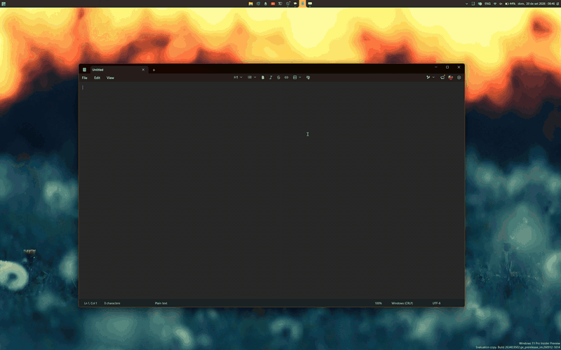
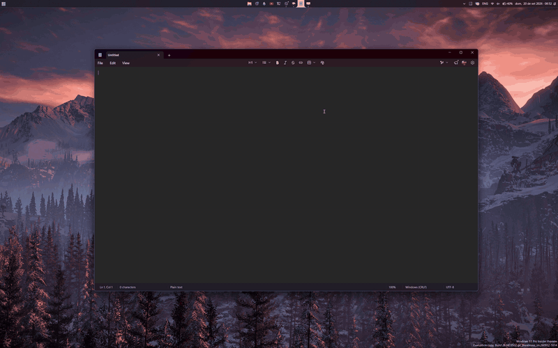

# Three Finger Drag assets

Screen recordings used in the readme of the
[Three Finger Drag](https://github.com/ramensoftware/windhawk-mods/blob/main/mods/three-finger-drag.wh.cpp)
Windhawk mod, which moves the window under the cursor when three fingers are
dragged on a precision touchpad.

## Moving and snapping a window

Three fingers grab the window from anywhere in it, not just the title bar, and
dropping it at the side of the screen snaps it there.

## PowerToys FancyZones, with Shift held

Windows moves the window itself, so the drag reaches everything which watches
for one. Holding Shift hands it to FancyZones, the way a title bar drag does.

